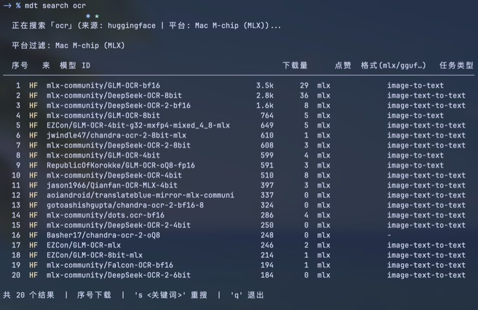
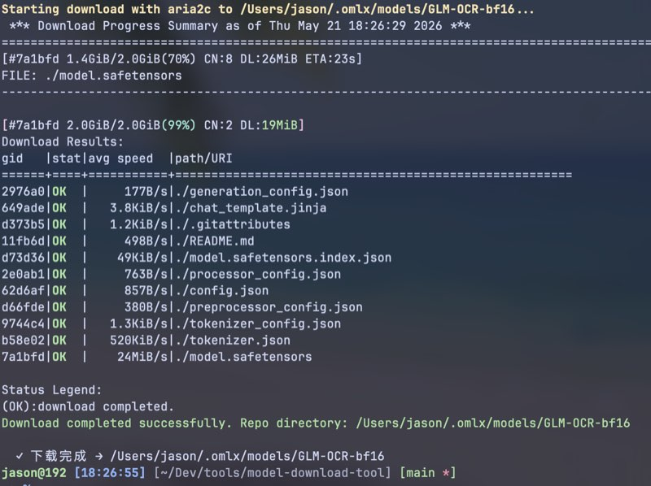

# mdt — Model Download Tool

[](https://www.python.org/)
[](https://ml-explore.github.io/mlx/)
[](https://hf-mirror.com)
[](https://hf-mirror.com/hfd/hfd.sh)
[](LICENSE)

**简单、快速**的 AI 模型搜索与下载一体化工具。

- 集成 **hfd 多线程下载器** + **国内镜像 hf-mirror.com**，国内网络直连、无需代理
- **搜索即下载**：模糊搜索 → 列表选择 → 一键下载，全程交互
- **默认适配 Mac M 芯片（MLX 格式）**，搜索结果自动过滤 Apple Silicon 原生模型
- 修改 `config.json` 一行即可切换为 Windows / Linux / GGUF 等其他平台

---

## 效果预览

**搜索模型**



**下载进度（aria2c 多线程）**



---

## 快速开始

```bash
# 建议先激活 ML 虚拟环境
source ~/venvs/ml/bin/activate   # python3.12 -m venv ~/venvs/ml

# 1. 初始化（下载 hfd.sh、检查工具链、生成 config.json）
python3 mdt.py setup

# 2. 搜索并下载（默认 Mac M-chip MLX）
mdt search "OCR"
mdt search "llama"

# 3. 直接下载指定模型
mdt download mlx-community/Qwen3-8B-4bit-mlx

# 4. 查看已下载模型
mdt list
```

> 设置全局 `mdt` 命令，在 `~/.zshrc` 中添加：
> ```bash
> source ~/venvs/ml/bin/activate
> export HF_ENDPOINT=https://hf-mirror.com
> alias mdt='python3 /path/to/mdt.py'
> ```

---

## 为什么用 mdt？

| 痛点 | mdt 的解法 |
|------|-----------|
| huggingface.co 国内访问慢 | 内置 hf-mirror.com 镜像，开箱即用 |
| 大模型下载动辄中断 | hfd + aria2c 多线程 + 断点续传 |
| 不知道下哪个版本 | 搜索结果按下载量排序，格式列清晰标注 |
| Mac 下载到 PyTorch 版用不了 | 默认过滤 MLX 格式，全是 Apple Silicon 原生模型 |
| 换平台要改很多参数 | 修改 `config.json` 一行即可，CLI 参数自动跟随 |

---

## 平台过滤

通过 `--platform` 切换，或修改 `config.json` 中的 `platform` 字段永久生效：

| 平台值 | 过滤格式 | 适用场景 |
|--------|---------|---------|
| `mac` | MLX | Apple Silicon 原生加速（**默认**）|
| `mac-gguf` | GGUF | llama.cpp + Metal，适合大语言模型 |
| `gguf` | GGUF | 跨平台，CPU/GPU 均可 |
| `windows` | 无 | Windows CUDA / CPU |
| `linux` | 无 | Linux CUDA / CPU |
| `all` | 无 | 不过滤，显示全部 |

```bash
mdt search "llama"                       # 默认：Mac MLX
mdt search "llama" --platform mac-gguf  # GGUF + Metal
mdt search "llama" --platform all       # 全平台不过滤

# 永久改为全平台：
mdt config platform all
```

> **MLX 说明**：MLX 模型的文件扩展名是 `.safetensors`，这是正常的。
> mlx-community 发布的模型均为 Apple Silicon 优化版，用 `mlx_lm` 或 `mlx-vlm` 加载即可。

---

## config.json 配置文件

`setup` 后自动生成，所有默认值可在此修改，无需每次传命令行参数。

```json
{
  "download_dir": "~/.omlx/models",
  "mirror":       "https://hf-mirror.com",
  "platform":     "mac",
  "source":       "huggingface",
  "limit":        20,
  "threads":      8,
  "jobs":         5,
  "token":        ""
}
```

命令行快速修改单项：

```bash
mdt config platform all        # 切换为全平台
mdt config limit 30            # 默认显示 30 条
mdt config token hf_xxxxxxx    # 设置 HF Token（下载受限模型用）
mdt config                     # 查看所有当前配置
```

---

## 命令参考

```
mdt setup                      初始化工具链，生成 config.json
mdt config [key] [value]       查看或修改配置
mdt search [关键词]             搜索并交互式下载
mdt download <模型ID>           直接下载指定模型
mdt list                       查看已下载模型及占用空间
```

### search 选项
```
--platform  平台过滤（默认来自 config.json）
--source    huggingface / modelscope / all
-n N        显示 N 条结果
--token     HuggingFace Access Token
```

### download 选项
```
--token     HuggingFace Access Token（受限模型）
-x N        单文件线程数（默认 8）
-j N        并行文件数（默认 5）
--include   只下载匹配文件，如 'mlx/*'
--exclude   排除匹配文件，如 '*.bin'
```

---

## 下载器优先级

工具自动检测并使用最优下载器，无需配置：

1. **hfd.sh + aria2c**（多线程，最快，推荐）
2. **huggingface-cli**（断点续传）
3. 首次 `setup` 时自动下载 `hfd.sh` 并安装 `huggingface_hub`

---

## 依赖

- **Python 3.8+**（搜索功能仅用标准库）
- **aria2c**（推荐）：`brew install aria2`
- 可选：`pip install huggingface_hub`
- 推荐虚拟环境：`python3.12 -m venv ~/venvs/ml`

---

## 受限模型

部分模型（Llama 等）需 HuggingFace 授权：

1. 在 [huggingface.co](https://huggingface.co) 申请模型访问权限
2. 在 [设置页](https://huggingface.co/settings/tokens) 创建 Read Token
3. 填入 `config.json` 的 `token` 字段，或用 `--token hf_xxx` 临时传入

## 已知限制：xet 存储的仓库不能走镜像

HuggingFace 新的 xet 存储会把下载 302 到签名 CDN URL，签名里绑死了 byte-range，
aria2 的多连接分片会全部返回 403。表现是走 `--mirror` 时报大量
`errorCode=22 ... status=403`，URL 里带 `xet-bridge`。

这类仓库改用 huggingface_hub 自带的 xet 客户端直连：

```bash
hf download <repo_id> --local-dir ~/.omlx/models/<name>
```

踩到这个坑的实例见 [docs/mage-vl-experiment.md](docs/mage-vl-experiment.md)。
